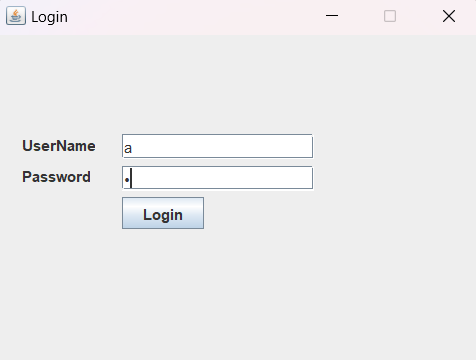
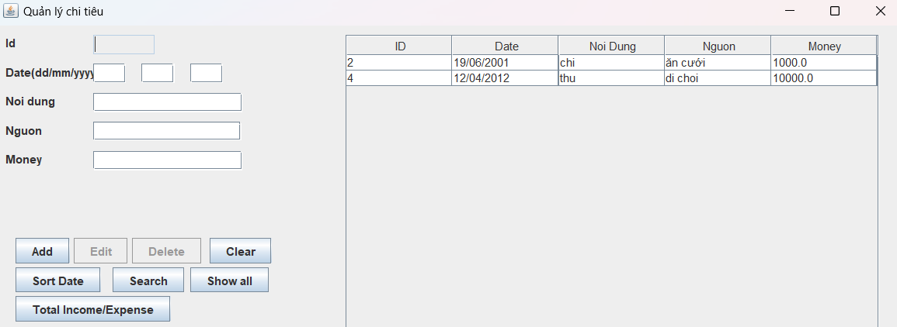
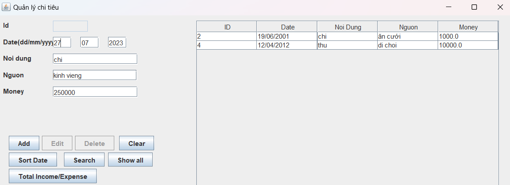
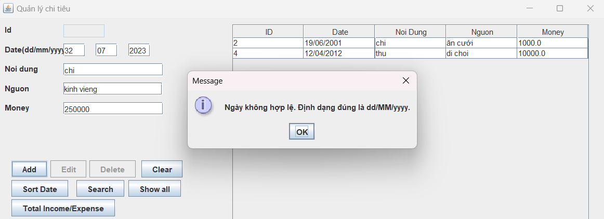

# QuanLiChiTieu

## 1. Thành viên
> Vũ Tuấn Anh 22010203
> 
> Nguyễn Trung Hiếu 22010486

## 2. Login account

Do đóng gói chưa thành công nên để chạy chương trình, chúng ta sẽ chạy file **App.java**. Sau khi chạy, màn hình sẽ hiện cửa sổ đăng nhập, khi đó bạn hãy nhập `a` tại ô `UserName` và `Password` sau đó nhấn nhấn `Login` để đăng nhập

## 3. Nhập data
Sau khi đăng nhập thành công thì một cửa sổ quản lí chi tiêu sẽ hiện ra

Lúc này bạn chỉ cần nhập dữ liệu vào:

- Mục **Date**: bạn sẽ nhập dữ liệu vào 3 ô tương ứng với ngày, tháng, năm. Bạn phải nhập đúng định dạng `dd/mm/yyyy` nếu không sẽ hiện cửa sổ báo lỗi
- Mục **Nội dung**: bạn buộc phải nhập `thu` hoặc là `chi` để xác định rõ đồng tiền vào hay đồng tiền ra
- Mục **Nguồn**: Bạn sẽ nhập vào để xác định rõ hơn đây là nguồn thu/ chi từ đâu. Ví dụ: ăn cưới, mua bán, ...
- Mục **Money**: Bạn sẽ nhập vào số tiền thu/ chi đó

## 4. Cách sử dụng các chức năng
- **Add**: thêm các dữ liệu mới vào bảng chi tiêu sau khi nhập xong
- **SortDate**: Sắp xếp lại bảng chi tiêu theo thứ tự từ ngày lâu nhất đến ngày gần nhất
- **Search**: Người dùng sẽ nhập vào ngày, tháng, năm mà mình muốn tìm kiếm sau đó nhấn nút `Search`, nếu có thì sẽ hiển thông tin thu/ chi của ngày nhập lên bảng chi tiêu
- **Total Income/Expense**: Sẽ tính tổng các dữ liệu có nội dung là `thu` và `chi` trong bảng chi tiêu sau đó so sánh 2 tổng thu và tổng chi. Nếu tổng chi lớn hơn tổng thu thì sẽ đưa ra cảnh báo
- ***Còn lại các chức năng khác hiện chưa hoàn thiện***
### 5. Tổng kết
Dự án `Quản Lí Chi Tiêu` là một phần mềm giúp người dùng có thể thực hiện việc chi tiêu một cách hợp lí, hạn chế được những rủi ro liên quan đến việc chi tiêu, đồng thời cũng giúp người dùng tối ưu hóa được việc chi tiêu từ đó có thể dễ dàng hoàn thành các mục tiêu hay kế hoạch tài chính.
Hiện tại dự án vẫn còn có những thiếu sót, rất mong người dùng có thể kiên nhẫn chờ đợi trong thời gian đội ngũ phát triển khắc phục và hoàn thiện dự án để đem đến cho người dùng nhanh nhất có thể! Xin cảm ơn!